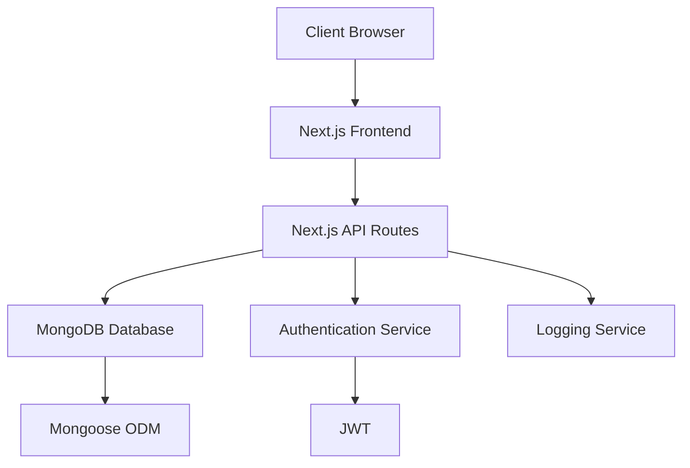
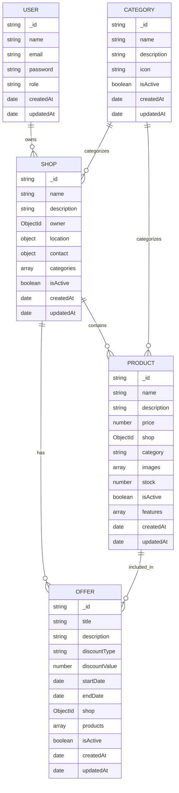

# Super Mall Web Application - Low Level Design (LLD)

## 1. Introduction

This document provides a detailed low-level design for the Super Mall Web Application, covering the system architecture, component interactions, data flow, and implementation details.

## 2. System Architecture

### 2.1 High-Level Architecture

The application follows a client-server architecture with the following components:

1. **Frontend**: Next.js application with React components
2. **Backend**: Next.js API routes serving as RESTful endpoints
3. **Database**: MongoDB with Mongoose ODM
4. **Authentication**: JWT-based authentication system
5. **Logging**: Winston-based structured logging

### 2.2 Component Diagram



## 3. Database Design

### 3.1 Entity Relationship Diagram



### 3.2 Collections and Schemas

#### User Collection
```javascript
{
  _id: ObjectId,
  name: String,
  email: String, // Unique, indexed
  password: String, // Hashed
  role: String, // Enum: admin, merchant, customer
  createdAt: Date,
  updatedAt: Date
}
```

#### Shop Collection
```javascript
{
  _id: ObjectId,
  name: String,
  description: String,
  owner: ObjectId, // Reference to User
  location: {
    floor: Number,
    section: String,
    coordinates: {
      x: Number,
      y: Number
    }
  },
  contact: {
    phone: String,
    email: String,
    address: String
  },
  categories: [String],
  isActive: Boolean,
  createdAt: Date,
  updatedAt: Date
}
```

#### Product Collection
```javascript
{
  _id: ObjectId,
  name: String,
  description: String,
  price: Number,
  shop: ObjectId, // Reference to Shop
  category: String,
  images: [String], // URLs
  stock: Number,
  isActive: Boolean,
  features: [{
    name: String,
    value: String
  }],
  createdAt: Date,
  updatedAt: Date
}
```

#### Offer Collection
```javascript
{
  _id: ObjectId,
  title: String,
  description: String,
  discountType: String, // Enum: percentage, fixed
  discountValue: Number,
  startDate: Date,
  endDate: Date,
  shop: ObjectId, // Reference to Shop
  products: [ObjectId], // References to Products
  isActive: Boolean,
  createdAt: Date,
  updatedAt: Date
}
```

#### Category Collection
```javascript
{
  _id: ObjectId,
  name: String, // Unique, indexed
  description: String,
  icon: String, // URL
  isActive: Boolean,
  createdAt: Date,
  updatedAt: Date
}
```

## 4. API Design

### 4.1 Authentication Endpoints

#### Register User
- **URL**: `POST /api/auth/register`
- **Request Body**:
  ```json
  {
    "name": "string",
    "email": "string",
    "password": "string",
    "role": "string" // admin, merchant, customer
  }
  ```
- **Response**:
  ```json
  {
    "message": "User registered successfully",
    "user": {
      "id": "string",
      "name": "string",
      "email": "string",
      "role": "string"
    },
    "token": "string"
  }
  ```

#### Login User
- **URL**: `POST /api/auth/login`
- **Request Body**:
  ```json
  {
    "email": "string",
    "password": "string"
  }
  ```
- **Response**:
  ```json
  {
    "message": "Login successful",
    "user": {
      "id": "string",
      "name": "string",
      "email": "string",
      "role": "string"
    },
    "token": "string"
  }
  ```

### 4.2 Shop Endpoints

#### Get Shops
- **URL**: `GET /api/shops`
- **Query Parameters**:
  - `page`: number (default: 1)
  - `limit`: number (default: 10)
  - `category`: string
  - `floor`: number
- **Response**:
  ```json
  {
    "shops": [Shop],
    "pagination": {
      "page": number,
      "limit": number,
      "total": number,
      "pages": number
    }
  }
  ```

#### Create Shop
- **URL**: `POST /api/shops`
- **Request Body**:
  ```json
  {
    "name": "string",
    "description": "string",
    "owner": "string", // User ID
    "location": {
      "floor": number,
      "section": "string"
    },
    "contact": {
      "phone": "string",
      "email": "string",
      "address": "string"
    },
    "categories": ["string"]
  }
  ```
- **Response**:
  ```json
  {
    "message": "Shop created successfully",
    "shop": Shop
  }
  ```

#### Get Shop by ID
- **URL**: `GET /api/shops/{id}`
- **Response**:
  ```json
  {
    "shop": Shop
  }
  ```

#### Update Shop
- **URL**: `PUT /api/shops/{id}`
- **Request Body**: Partial Shop object
- **Response**:
  ```json
  {
    "message": "Shop updated successfully",
    "shop": Shop
  }
  ```

#### Delete Shop
- **URL**: `DELETE /api/shops/{id}`
- **Response**:
  ```json
  {
    "message": "Shop deleted successfully"
  }
  ```

### 4.3 Product Endpoints

#### Get Products
- **URL**: `GET /api/products`
- **Query Parameters**:
  - `page`: number (default: 1)
  - `limit`: number (default: 10)
  - `category`: string
  - `shop`: string (Shop ID)
  - `minPrice`: number
  - `maxPrice`: number
- **Response**:
  ```json
  {
    "products": [Product],
    "pagination": {
      "page": number,
      "limit": number,
      "total": number,
      "pages": number
    }
  }
  ```

#### Create Product
- **URL**: `POST /api/products`
- **Request Body**:
  ```json
  {
    "name": "string",
    "description": "string",
    "price": number,
    "shop": "string", // Shop ID
    "category": "string",
    "images": ["string"],
    "stock": number,
    "features": [{
      "name": "string",
      "value": "string"
    }]
  }
  ```
- **Response**:
  ```json
  {
    "message": "Product created successfully",
    "product": Product
  }
  ```

#### Get Product by ID
- **URL**: `GET /api/products/{id}`
- **Response**:
  ```json
  {
    "product": Product
  }
  ```

#### Update Product
- **URL**: `PUT /api/products/{id}`
- **Request Body**: Partial Product object
- **Response**:
  ```json
  {
    "message": "Product updated successfully",
    "product": Product
  }
  ```

#### Delete Product
- **URL**: `DELETE /api/products/{id}`
- **Response**:
  ```json
  {
    "message": "Product deleted successfully"
  }
  ```

### 4.4 Offer Endpoints

#### Get Offers
- **URL**: `GET /api/offers`
- **Query Parameters**:
  - `page`: number (default: 1)
  - `limit`: number (default: 10)
  - `shop`: string (Shop ID)
  - `activeOnly`: boolean
- **Response**:
  ```json
  {
    "offers": [Offer],
    "pagination": {
      "page": number,
      "limit": number,
      "total": number,
      "pages": number
    }
  }
  ```

#### Create Offer
- **URL**: `POST /api/offers`
- **Request Body**:
  ```json
  {
    "title": "string",
    "description": "string",
    "discountType": "string", // percentage or fixed
    "discountValue": number,
    "startDate": "date",
    "endDate": "date",
    "shop": "string", // Shop ID
    "products": ["string"] // Product IDs
  }
  ```
- **Response**:
  ```json
  {
    "message": "Offer created successfully",
    "offer": Offer
  }
  ```

#### Get Offer by ID
- **URL**: `GET /api/offers/{id}`
- **Response**:
  ```json
  {
    "offer": Offer
  }
  ```

#### Update Offer
- **URL**: `PUT /api/offers/{id}`
- **Request Body**: Partial Offer object
- **Response**:
  ```json
  {
    "message": "Offer updated successfully",
    "offer": Offer
  }
  ```

#### Delete Offer
- **URL**: `DELETE /api/offers/{id}`
- **Response**:
  ```json
  {
    "message": "Offer deleted successfully"
  }
  ```

### 4.5 Category Endpoints

#### Get Categories
- **URL**: `GET /api/categories`
- **Query Parameters**:
  - `page`: number (default: 1)
  - `limit`: number (default: 10)
  - `activeOnly`: boolean
- **Response**:
  ```json
  {
    "categories": [Category],
    "pagination": {
      "page": number,
      "limit": number,
      "total": number,
      "pages": number
    }
  }
  ```

#### Create Category
- **URL**: `POST /api/categories`
- **Request Body**:
  ```json
  {
    "name": "string",
    "description": "string",
    "icon": "string" // URL
  }
  ```
- **Response**:
  ```json
  {
    "message": "Category created successfully",
    "category": Category
  }
  ```

#### Get Category by ID
- **URL**: `GET /api/categories/{id}`
- **Response**:
  ```json
  {
    "category": Category
  }
  ```

#### Update Category
- **URL**: `PUT /api/categories/{id}`
- **Request Body**: Partial Category object
- **Response**:
  ```json
  {
    "message": "Category updated successfully",
    "category": Category
  }
  ```

#### Delete Category
- **URL**: `DELETE /api/categories/{id}`
- **Response**:
  ```json
  {
    "message": "Category deleted successfully"
  }
  ```

## 5. Frontend Components

### 5.1 Component Hierarchy

```
App
├── Header
├── HomePage
│   ├── HeroSection
│   ├── FeaturedShops
│   │   └── ShopCard
│   ├── FeaturedProducts
│   │   └── ProductCard
│   └── CurrentOffers
│       └── OfferCard
├── ShopsPage
│   ├── ShopFilters
│   └── ShopList
│       └── ShopCard
├── ProductsPage
│   ├── ProductFilters
│   └── ProductList
│       └── ProductCard
├── OffersPage
│   ├── OfferFilters
│   └── OfferList
│       └── OfferCard
├── LoginPage
├── RegisterPage
└── Footer
```

### 5.2 Key Components

#### Header
- Navigation menu
- Authentication links (Login/Register)

#### ShopCard
- Displays shop name, description, location
- Shows categories
- Links to shop details

#### ProductCard
- Displays product name, description, price
- Shows category
- Links to product details

#### OfferCard
- Displays offer title, description, discount
- Shows shop name
- Shows validity period
- Links to offer details

## 6. Authentication Flow

### 6.1 Registration Flow
1. User fills registration form
2. Frontend sends POST request to `/api/auth/register`
3. Backend validates input
4. Backend checks if user already exists
5. Backend hashes password
6. Backend creates user in database
7. Backend generates JWT token
8. Backend returns user data and token
9. Frontend stores token in localStorage
10. Frontend redirects to home page

### 6.2 Login Flow
1. User fills login form
2. Frontend sends POST request to `/api/auth/login`
3. Backend validates input
4. Backend finds user by email
5. Backend compares password hash
6. Backend generates JWT token
7. Backend returns user data and token
8. Frontend stores token in localStorage
9. Frontend redirects to home page

### 6.3 Protected Route Access
1. User navigates to protected route
2. Frontend checks for JWT token in localStorage
3. If token exists and is valid, allow access
4. If token doesn't exist or is invalid, redirect to login

## 7. Error Handling

### 7.1 API Error Responses
All API endpoints return standardized error responses:
```json
{
  "error": "Error message"
}
```

With appropriate HTTP status codes:
- 400: Bad Request (validation errors)
- 401: Unauthorized (authentication required)
- 403: Forbidden (insufficient permissions)
- 404: Not Found (resource not found)
- 500: Internal Server Error (unexpected errors)

### 7.2 Frontend Error Handling
- Display user-friendly error messages
- Log errors to console in development
- Handle network errors gracefully
- Show loading states during API requests

## 8. Logging

### 8.1 Log Levels
- **Error**: Critical errors that require immediate attention
- **Warn**: Potential issues that should be investigated
- **Info**: General information about system operations
- **Debug**: Detailed information for debugging (development only)

### 8.2 Log Format
```json
{
  "timestamp": "ISO timestamp",
  "level": "log level",
  "message": "log message",
  "meta": {
    "service": "supermall-api",
    "additional": "context data"
  }
}
```

### 8.3 Log Destinations
- **File**: Error logs written to `logs/error.log`
- **File**: Combined logs written to `logs/combined.log`
- **Console**: All logs output to console in development

## 9. Security Considerations

### 9.1 Authentication Security
- Passwords hashed with bcrypt (10 rounds)
- JWT tokens with 7-day expiration
- Secure HTTP-only cookies for token storage (future enhancement)

### 9.2 Data Validation
- Input validation on both frontend and backend
- Sanitization of user inputs
- Mongoose schema validation

### 9.3 API Security
- CORS configuration
- Rate limiting (future enhancement)
- Input length limits
- MongoDB injection prevention

### 9.4 Data Security
- HTTPS in production
- Environment variables for secrets
- Database access controls

## 10. Performance Optimization

### 10.1 Database Optimization
- Indexes on frequently queried fields
- Pagination for large result sets
- Aggregation pipelines for complex queries

### 10.2 API Optimization
- Caching with Redis (future enhancement)
- Database connection pooling
- Efficient query design

### 10.3 Frontend Optimization
- Code splitting with dynamic imports
- Image optimization with Next.js Image component
- Server-side rendering for better SEO
- Static site generation where appropriate

## 11. Testing Strategy

### 11.1 Unit Testing
- Test individual functions and components
- Mock external dependencies
- Achieve high code coverage

### 11.2 Integration Testing
- Test API endpoints
- Test database operations
- Test authentication flow

### 11.3 End-to-End Testing
- Test user workflows
- Test UI interactions
- Test cross-browser compatibility

## 12. Deployment Architecture

### 12.1 Vercel Deployment
- Frontend and API routes deployed to Vercel
- Automatic scaling
- Global CDN for static assets
- Serverless functions for API endpoints

### 12.2 MongoDB Atlas
- Cloud-hosted MongoDB database
- Automatic backups
- Global replication
- Monitoring and alerts

### 12.3 Environment Configuration
- Environment-specific configuration files
- Secret management with Vercel secrets
- Database connection pooling

## 13. Monitoring and Maintenance

### 13.1 Application Monitoring
- Error tracking with Sentry (future enhancement)
- Performance monitoring
- Uptime monitoring

### 13.2 Database Monitoring
- MongoDB Atlas monitoring
- Query performance analysis
- Storage capacity management

### 13.3 Log Analysis
- Centralized log management (future enhancement)
- Log aggregation and analysis
- Alerting for critical errors

## 14. Future Enhancements

### 14.1 Feature Enhancements
- Shopping cart functionality
- Order management system
- Payment integration
- User reviews and ratings
- Wishlist functionality

### 14.2 Technical Enhancements
- Real-time notifications with WebSockets
- Caching with Redis
- Search functionality with Elasticsearch
- Microservices architecture
- Mobile app development

This LLD document provides a comprehensive overview of the Super Mall Web Application's design and implementation details. It serves as a reference for developers working on the project and can be updated as the application evolves.