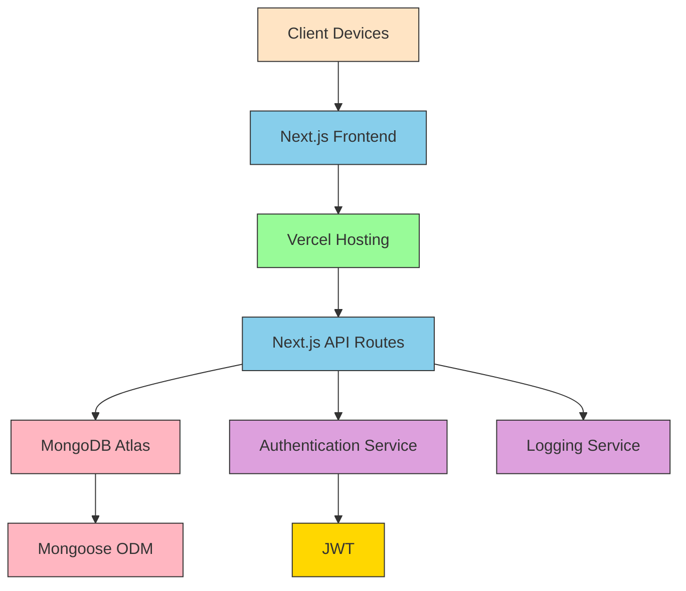
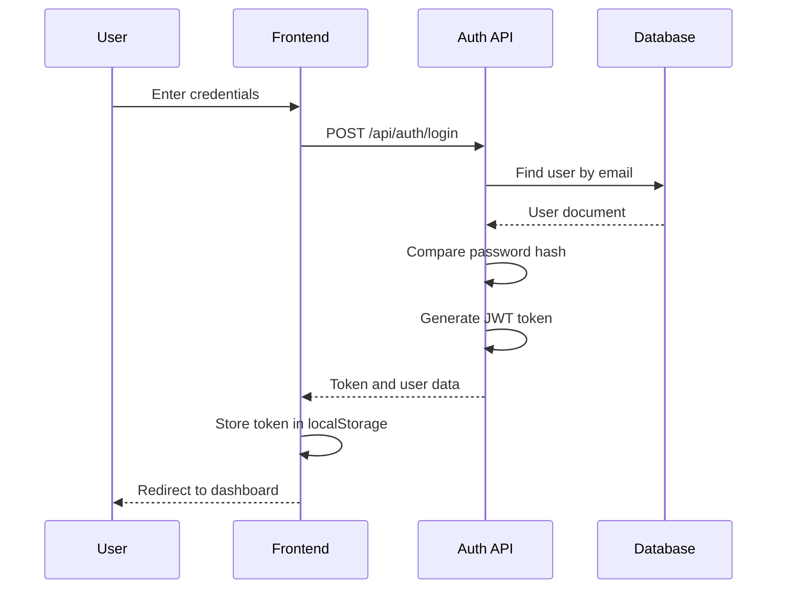
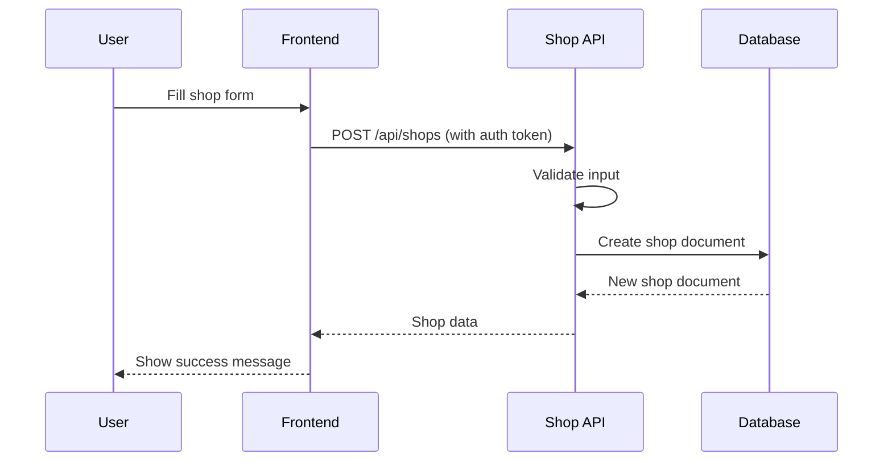
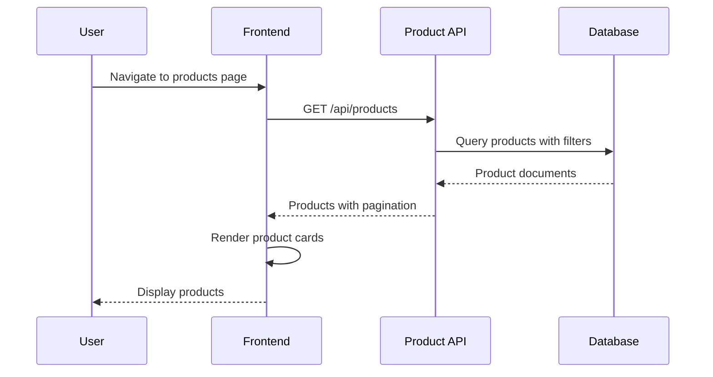
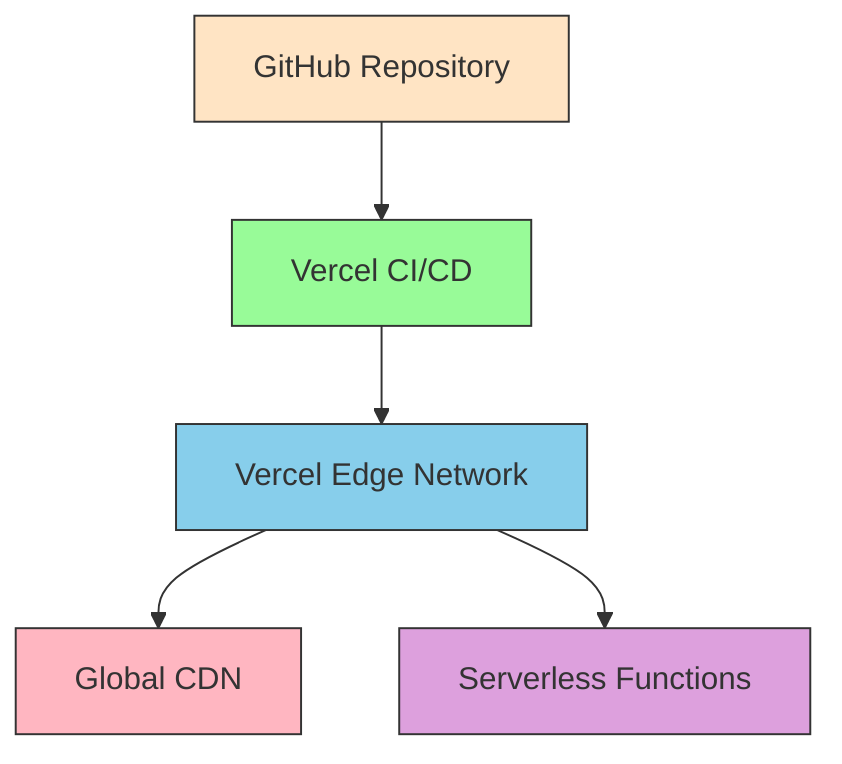
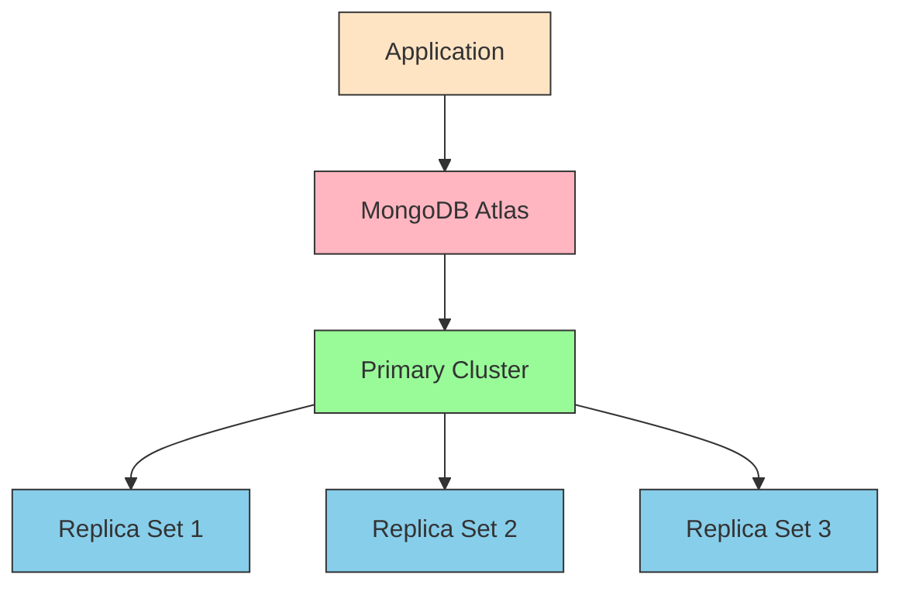

# Super Mall Web Application - System Architecture

## 1. Overview

The Super Mall Web Application is a comprehensive e-commerce platform designed for managing shops, products, and offers in a mall environment. This document outlines the system architecture, including the high-level design, component interactions, and deployment strategy.

## 2. High-Level Architecture

### 2.1 Architecture Diagram



### 2.2 Component Description

1. **Client Devices**: Web browsers accessing the application
2. **Next.js Frontend**: React-based user interface with TypeScript and Tailwind CSS
3. **Vercel Hosting**: Cloud platform for hosting frontend and backend services
4. **Next.js API Routes**: Serverless functions handling backend logic
5. **MongoDB Atlas**: Cloud-hosted MongoDB database
6. **Authentication Service**: JWT-based authentication system
7. **Logging Service**: Winston-based structured logging
8. **Mongoose ODM**: Object Document Mapper for MongoDB

## 3. System Components

### 3.1 Frontend Layer

The frontend is built with Next.js using the App Router, providing:

- **Server-Side Rendering (SSR)**: Improved SEO and initial load performance
- **Static Site Generation (SSG)**: Pre-rendered pages for better performance
- **Client-Side Navigation**: Smooth page transitions
- **Responsive Design**: Mobile-first approach with Tailwind CSS
- **Type Safety**: TypeScript for compile-time error checking

#### Key Features:
- User authentication (login/register)
- Shop browsing with filtering
- Product catalog with search
- Offer listings
- Admin dashboard for shop management

### 3.2 Backend Layer

The backend consists of Next.js API routes that serve as RESTful endpoints:

- **Authentication Routes**: User registration and login
- **Shop Management Routes**: CRUD operations for shops
- **Product Management Routes**: CRUD operations for products
- **Offer Management Routes**: CRUD operations for offers
- **Category Management Routes**: CRUD operations for categories

#### Key Features:
- JWT-based authentication middleware
- Input validation and sanitization
- Database operations with Mongoose
- Structured logging with Winston
- Error handling and response standardization

### 3.3 Database Layer

MongoDB with Mongoose ODM provides:

- **Document-based storage**: Flexible schema design
- **Horizontal scaling**: Sharding support for large datasets
- **Replication**: High availability and data redundancy
- **Indexing**: Optimized query performance
- **Aggregation framework**: Complex data analysis

#### Collections:
- Users: Store user account information
- Shops: Store shop details and metadata
- Products: Store product information
- Offers: Store promotional offers
- Categories: Store product categories

### 3.4 Authentication Layer

JWT-based authentication system:

- **Token Generation**: Secure token creation with expiration
- **Token Verification**: Middleware for protected routes
- **Password Security**: bcrypt hashing for password storage
- **Role-based Access**: Different permissions for admin/merchant/customer

### 3.5 Logging Layer

Winston-based logging system:

- **Structured Logging**: JSON format for easy parsing
- **Multiple Transports**: File and console outputs
- **Log Levels**: Error, warn, info, debug
- **Contextual Information**: Request IDs, user IDs, etc.

## 4. Data Flow

### 4.1 User Authentication Flow



### 4.2 Shop Creation Flow



### 4.3 Product Listing Flow



## 5. Wireframes

### 5.1 Home Page Wireframe

```
+-------------------------------------------------------------+
| Header: Logo, Navigation, Login/Register                    |
+-------------------------------------------------------------+
| Hero Section: Welcome message, call-to-action               |
+-------------------------------------------------------------+
| Featured Shops                                              |
| +----------+  +----------+  +----------+                   |
| | Shop 1   |  | Shop 2   |  | Shop 3   |                   |
| | Name     |  | Name     |  | Name     |                   |
| | Desc     |  | Desc     |  | Desc     |                   |
| | Location |  | Location |  | Location |                   |
| +----------+  +----------+  +----------+                   |
+-------------------------------------------------------------+
| Featured Products                                           |
| +----------+  +----------+  +----------+                   |
| | Product1 |  | Product2 |  | Product3 |                   |
| | Name     |  | Name     |  | Name     |                   |
| | Price    |  | Price    |  | Price    |                   |
| | Image    |  | Image    |  | Image    |                   |
| +----------+  +----------+  +----------+                   |
+-------------------------------------------------------------+
| Current Offers                                              |
| +----------+  +----------+  +----------+                   |
| | Offer 1  |  | Offer 2  |  | Offer 3  |                   |
| | Title    |  | Title    |  | Title    |                   |
| | Discount |  | Discount |  | Discount |                   |
| | Period   |  | Period   |  | Period   |                   |
| +----------+  +----------+  +----------+                   |
+-------------------------------------------------------------+
| Footer: Links, Contact Info, Copyright                      |
+-------------------------------------------------------------+
```

### 5.2 Shops Page Wireframe

```
+-------------------------------------------------------------+
| Header: Logo, Navigation, Login/Register                    |
+-------------------------------------------------------------+
| Shops Page Header: "Shops"                                  |
+-------------------------------------------------------------+
| Filters: Search, Floor, Category                            |
| +---------------------------------------------------------+ |
| | Search: [___________________________]  [Search Button]  | |
| | Floor: [All Floors ▼]  Category: [All Categories ▼]     | |
| +---------------------------------------------------------+ |
+-------------------------------------------------------------+
| Shop Listings                                               |
| +----------+  +----------+  +----------+                   |
| | Shop 1   |  | Shop 2   |  | Shop 3   |                   |
| | Name     |  | Name     |  | Name     |                   |
| | Desc     |  | Desc     |  | Desc     |                   |
| | Location |  | Location |  | Location |                   |
| +----------+  +----------+  +----------+                   |
| +----------+  +----------+  +----------+                   |
| | Shop 4   |  | Shop 5   |  | Shop 6   |                   |
| | Name     |  | Name     |  | Name     |                   |
| | Desc     |  | Desc     |  | Desc     |                   |
| | Location |  | Location |  | Location |                   |
| +----------+  +----------+  +----------+                   |
+-------------------------------------------------------------+
| Pagination: [Prev] 1 2 3 4 ... [Next]                       |
+-------------------------------------------------------------+
| Footer: Links, Contact Info, Copyright                      |
+-------------------------------------------------------------+
```

### 5.3 Products Page Wireframe

```
+-------------------------------------------------------------+
| Header: Logo, Navigation, Login/Register                    |
+-------------------------------------------------------------+
| Products Page Header: "Products"                            |
+-------------------------------------------------------------+
| Filters: Search, Category, Price Range                      |
| +---------------------------------------------------------+ |
| | Search: [___________________________]  [Search Button]  | |
| | Category: [All Categories ▼]                            | |
| | Price: $0 ------------------------------------ $2000    | |
| +---------------------------------------------------------+ |
+-------------------------------------------------------------+
| Product Listings                                            |
| +----------+  +----------+  +----------+                   |
| | Product1 |  | Product2 |  | Product3 |                   |
| | Name     |  | Name     |  | Name     |                   |
| | Price    |  | Price    |  | Price    |                   |
| | Image    |  | Image    |  | Image    |                   |
| +----------+  +----------+  +----------+                   |
| +----------+  +----------+  +----------+                   |
| | Product4 |  | Product5 |  | Product6 |                   |
| | Name     |  | Name     |  | Name     |                   |
| | Price    |  | Price    |  | Price    |                   |
| | Image    |  | Image    |  | Image    |                   |
| +----------+  +----------+  +----------+                   |
+-------------------------------------------------------------+
| Pagination: [Prev] 1 2 3 4 ... [Next]                       |
+-------------------------------------------------------------+
| Footer: Links, Contact Info, Copyright                      |
+-------------------------------------------------------------+
```

### 5.4 Offers Page Wireframe

```
+-------------------------------------------------------------+
| Header: Logo, Navigation, Login/Register                    |
+-------------------------------------------------------------+
| Offers Page Header: "Offers"                                |
+-------------------------------------------------------------+
| Filters: Search, Shop, Active Only                          |
| +---------------------------------------------------------+ |
| | Search: [___________________________]  [Search Button]  | |
| | Shop: [All Shops ▼]                                     | |
| | [x] Show only active offers                             | |
| +---------------------------------------------------------+ |
+-------------------------------------------------------------+
| Offer Listings                                              |
| +----------+  +----------+  +----------+                   |
| | Offer 1  |  | Offer 2  |  | Offer 3  |                   |
| | Title    |  | Title    |  | Title    |                   |
| | Discount |  | Discount |  | Discount |                   |
| | Period   |  | Period   |  | Period   |                   |
| +----------+  +----------+  +----------+                   |
| +----------+  +----------+  +----------+                   |
| | Offer 4  |  | Offer 5  |  | Offer 6  |                   |
| | Title    |  | Title    |  | Title    |                   |
| | Discount |  | Discount |  | Discount |                   |
| | Period   |  | Period   |  | Period   |                   |
| +----------+  +----------+  +----------+                   |
+-------------------------------------------------------------+
| Pagination: [Prev] 1 2 3 4 ... [Next]                       |
+-------------------------------------------------------------+
| Footer: Links, Contact Info, Copyright                      |
+-------------------------------------------------------------+
```

### 5.5 Login Page Wireframe

```
+-------------------------------------------------------------+
| Header: Logo, Navigation                                    |
+-------------------------------------------------------------+
|                    Login Form                               |
| +---------------------------------------------------------+ |
| | Email:                                                  | |
| | [___________________________]                           | |
| | Password:                                               | |
| | [___________________________]                           | |
| | [ ] Remember me            Forgot password?             | |
| |                                                         | |
| |         [Sign In Button]                                | |
| +---------------------------------------------------------+ |
| |                                                         | |
| |         Don't have an account? [Register]               | |
| +---------------------------------------------------------+ |
+-------------------------------------------------------------+
| Footer: Links, Contact Info, Copyright                      |
+-------------------------------------------------------------+
```

### 5.6 Register Page Wireframe

```
+-------------------------------------------------------------+
| Header: Logo, Navigation                                    |
+-------------------------------------------------------------+
|                  Registration Form                          |
| +---------------------------------------------------------+ |
| | Full Name:                                              | |
| | [___________________________]                           | |
| | Email:                                                  | |
| | [___________________________]                           | |
| | Password:                                               | |
| | [___________________________]                           | |
| | Role: [Customer ▼]                                      | |
| |                                                         | |
| |         [Create Account Button]                         | |
| +---------------------------------------------------------+ |
| |                                                         | |
| |         Already have an account? [Sign In]              | |
| +---------------------------------------------------------+ |
+-------------------------------------------------------------+
| Footer: Links, Contact Info, Copyright                      |
+-------------------------------------------------------------+
```

## 6. Deployment Architecture

### 6.1 Vercel Deployment



### 6.2 MongoDB Atlas Deployment



### 6.3 Deployment Process

1. **Development**: Code changes in local environment
2. **Version Control**: Push to GitHub repository
3. **Continuous Integration**: Vercel automatically builds and tests
4. **Deployment**: Vercel deploys to edge network
5. **Monitoring**: Application monitoring and logging

## 7. Scalability Considerations

### 7.1 Horizontal Scaling
- **Frontend**: Vercel's global CDN automatically scales
- **Backend**: Serverless functions scale automatically
- **Database**: MongoDB Atlas provides auto-scaling clusters

### 7.2 Performance Optimization
- **Caching**: Redis implementation for frequently accessed data
- **Database Indexing**: Proper indexing for query optimization
- **Code Splitting**: Dynamic imports for better loading performance
- **Image Optimization**: Next.js Image component for responsive images

### 7.3 Load Handling
- **Traffic Spikes**: Vercel's auto-scaling handles traffic increases
- **Database Performance**: MongoDB's sharding for large datasets
- **API Rate Limiting**: Implementation to prevent abuse

## 8. Security Architecture

### 8.1 Data Protection
- **Encryption**: HTTPS for data in transit
- **Hashing**: bcrypt for password storage
- **Environment Variables**: Secure storage of secrets

### 8.2 Access Control
- **Authentication**: JWT tokens for session management
- **Authorization**: Role-based access control
- **Input Validation**: Sanitization of user inputs

### 8.3 Monitoring
- **Logging**: Structured logging for audit trails
- **Error Tracking**: Sentry integration for error monitoring
- **Security Audits**: Regular security assessments

## 9. Monitoring and Maintenance

### 9.1 Application Monitoring
- **Performance Metrics**: Response times, error rates
- **User Analytics**: Usage patterns and behavior
- **Resource Utilization**: CPU, memory, and network usage

### 9.2 Database Monitoring
- **Query Performance**: Slow query analysis
- **Storage Usage**: Disk space and document counts
- **Connection Pooling**: Database connection management

### 9.3 Infrastructure Monitoring
- **Vercel Metrics**: Function execution times and errors
- **MongoDB Atlas**: Cluster health and performance
- **Alerting**: Automated notifications for critical issues

This system architecture document provides a comprehensive overview of the Super Mall Web Application's design, components, and deployment strategy. It serves as a blueprint for development, deployment, and maintenance of the application.